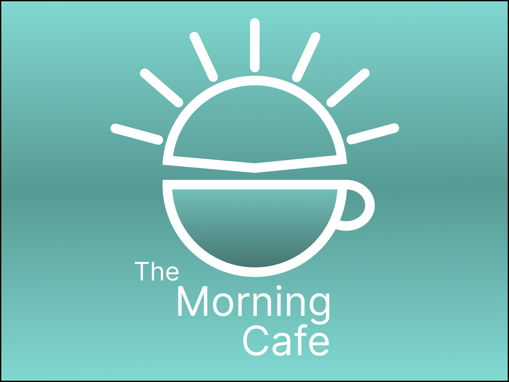
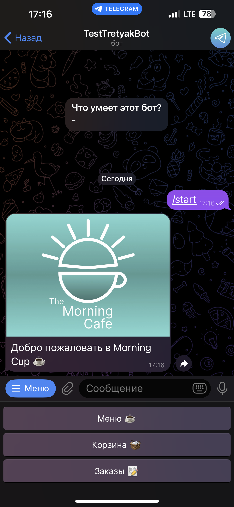
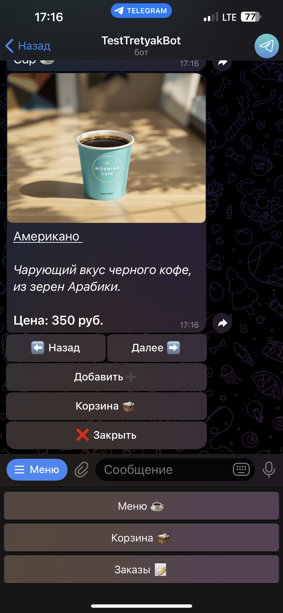
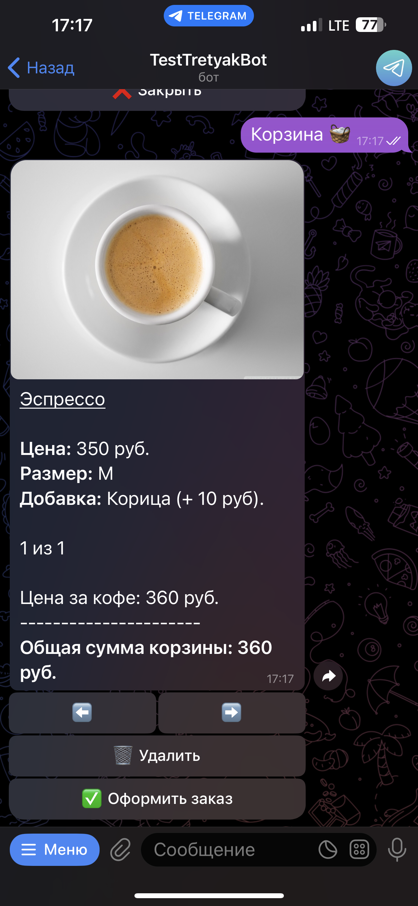
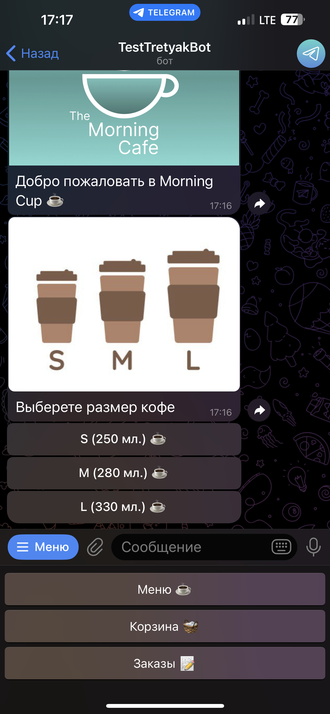
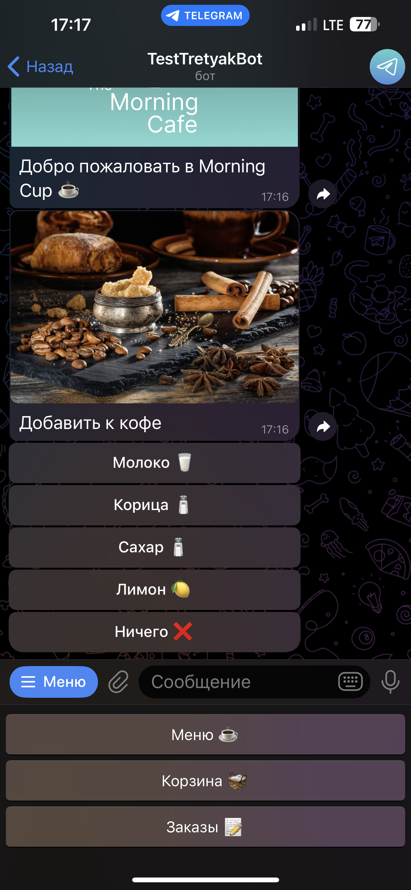
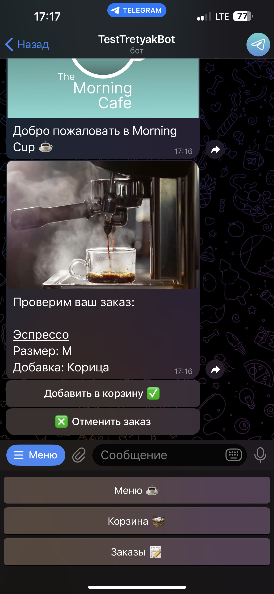
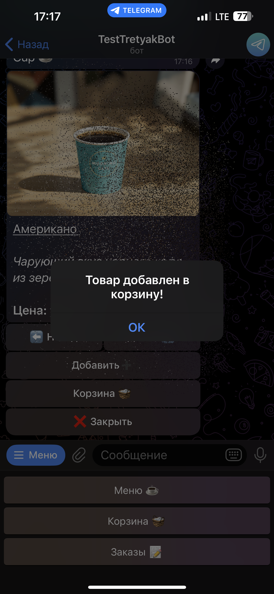
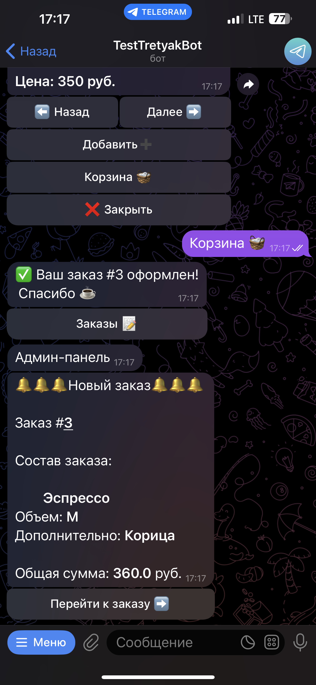
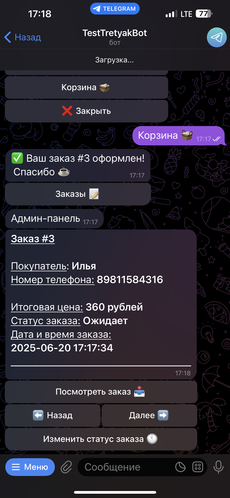

# ☕ Morning Cafe Telegram Bot

**Автоматизированная система заказов для кофейни**  
Позволяет клиентам заказывать напитки и еду прямо из Telegram

---

## 📌 О проекте
### 🧑‍💻 Для клиентов
  Бот предоставляет клиентам удобный интерфейс для:
  - Полноценное меню с фотографиями
  - Гибкая система добавок и вариантов
  - История предыдущих заказов
  - Уведомления о статусе заказа

### 👨‍💼 Для администраторов
- Редактирование меню в реальном времени
- Уведомления о новых заказах
- Управление заказами (4 статуса)

---

## 🏗 Структура проекта 
```text
├── config/                      # Конфигурационные файлы
│   └── create_jew_handlers.py   # Настройки бота и параметров
├── database/                    # Работа с данными
│   ├── images/                  # Изображения для базы данных
│   ├── database.db              # Файл базы данных SQLite
│   └── database.py              # Модуль работы с базой данных
├── handlers/                    # Основные обработчики
│   ├── admin_handlers.py        # Функционал администратора
│   ├── basket_handlers.py       # Работа с корзиной заказов
│   ├── command.py               # Системные команды бота
│   ├── menu_handlers.py         # Отображение меню
│   ├── order_handlers.py        # Оформление заказов
│   └── registration_handlers.py # Регистрация пользователей
── keyboards/                    # Управление клавиатурами
│   ├── inline_kb.py             # Reply-клавиатуры
│   └── reply_kb.py              # Создание новых украшений
── utils/                        # Вспомогательные утилиты
│   └── state.py                 # Состояния FSM
├── main.py                      # Главный исполняемый файл
└── README.md                    # Документация проекта
```

## ⚙️ Технологический стек

<p align="center">
  
  
  
</p>

---

## 🚀 Установка

1. Клонировать репозиторий:
   ```bash
   git clone https://github.com/Ilya-Tretyak/Morning_cafe.git
   cd Morning_cafe
   ``` 
2. Настроить окружение:
   ```bash
   python -m venv .venv
   ```
   ```bash
   source venv/bin/activate  # Linux/Mac
   ```
   ```bash
   venv\Scripts\activate     # Windows
   ```

3. Установить зависимости:
   ```bash
   pip install -r requirements.txt 
   ```
4. Запустить бота:
   ```bash
   python main.py 
   ```

## Демонстрация

📸 Демонстрация интерфейса
<div align="center">
  <table>
    <tr> 
      <td align="center"> </td> 
      <td align="center"> </td> 
    </tr> 
    <tr> 
      <td align="center"> </td>
      <td align="center"> </td>
    </tr>
    <tr> 
      <td align="center"> </td> 
      <td align="center"> </td> 
    </tr> 
    <tr> 
      <td align="center"> </td>
      <td align="center"> </td>
    </tr>
    <tr> 
      <td align="center"> </td> 
    </tr> 
  </table> 
</div>
